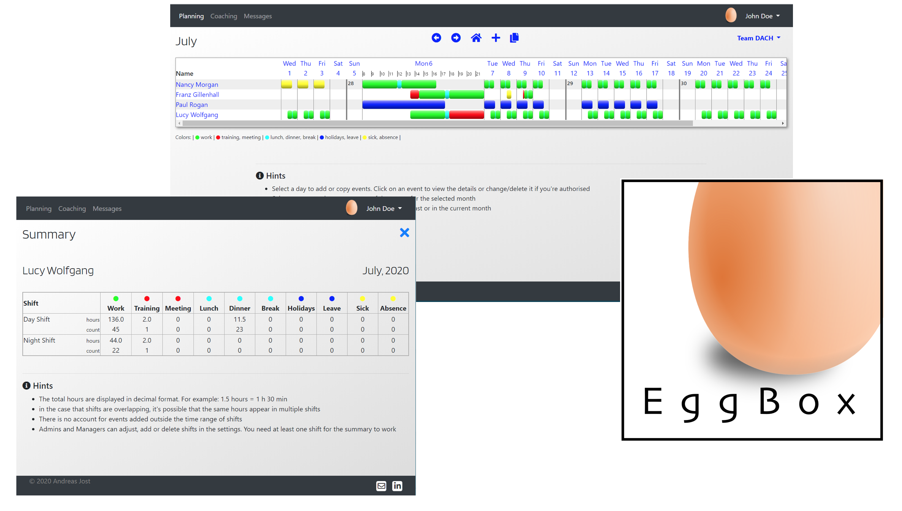

# EggBox

## Planning and coaching tool for great customer service teams.

### Get rid of your complicated spread sheets when you plan your team. One tool helps you to get organised and develop your staff - In one simple application.



Live-website: https://ci-ms4-team-tool.herokuapp.com/
You can log in (in the upper right corner)with the following credentials:
Username: 'company1@company1.com', Password: 'EggBox900' (without quotations)
In order to view sample data

This project is for educational purposes. Stripe payments have no effect and no emails are being sent.

# UX
## User stories:


## Strategy
Create a web service for a company to sign up and add employees (users). The page has a two fold strategy:
- Planning: A calendar type planning sheet for users to add and view their planning
- Coaching: Managers can plan their coaching sessions with Agents and set/check goals

## Scope

- A home page with Signup and Login functionality. A new Company to sign up initially gets the fee plan,
but can upgrade later in the settings to another (out of 4 plans)

- A backend database to support the functionality

- Sections for Planning, Coaching and Notifications

- Multiple settings and edit options according to the access permission level

- A total of 4 different access permission levels

- Set up of multiple teams

- Contact links


## Structure

### Please refer to the following PDF for a pagemap:

[Page Map](attachments/pagemap.pdf)

### This is the database schema (Sqlite3 in GitPod, Postgres in Heroku)

I decided to use a Shared table architecture (vs Multi tenant or multi database architecture) because that made it easier to change the database schema and migrations over the course of the project, and it uses less resources.

[Database Schema](attachments/database_schema.png)

- The Model 'Roles' is part of the schema even though it's currently not of any use to a user of the page. I left it in there
because there will be use in the future and there is already code in the project supporting it (mainly templates in the 'settings'-app),
and because records are already created upon signup (which will make implementation easier in the future for existing users).

- There are Fields which are there for users to fill out, but also serve a future purpose in Model 'Team': Planning deadline, coaching_rep, min_lunch/dinner/paid-break
    

### The difference between the 4 access levels:


| Task                                                    | Admin | Manager | Agent | Visitor |
|---------------------------------------------------------|-------|---------|-------|---------|
| Create company account                                  | x     |         |       |         |
| Create and edit user accounts                           | x     | x       |       |         |
| Add/remove/edit elements in planning                    | x     | x       | x     |         |
| See agent's summary                                     | x     | x       | x     | x       |
| See all user's planning                                 | x     | x       | x     | x       |
| Create all user's coaching sessions                     |       | x       |       |         |
| See their own coaching goals                            |       |         | x     |         |
| Notification when other user's planning was modified    | x     | x       |       |         |


## Surface
- Simple yet inviting home page displaying the 3 most
important key functions of the Web App. Two Buttons on top, for Signup (call to action) and Login.
Footer at the bottom social links.
- Inside the page: Bigger emphasis on function than on form, because it's a corporate application
- Simple business-like color scheme (black white gray blue) inside the application
- Buttons slightly rounded and whenever possible the same size
- blue links signalise interaction (clickable)
- Show the main sections highlighted when selected (Planning/Coaching/Messages)
- Constant use of 2 fonts: Blinker for titles, Roboton (or Bootstrap standard) for text
- Fontawesome icons when appropriate
- Use of pictures that fit the described color scheme

# Features

### Current Features
- Company account creation
- Offering 4 different plans
- User account creation through an admin
- An Agent/Manager sees the planning of the corresponding team as a starting page after Login
- Creation of events in the planning
- Entry of coaching sessions by managers
- Messages (Messages section)
    - For Managers: when an Agent submits his planning or checks off a coaching goal
    - For Agents: When the Manager Approved or changed a planning, created/edited/deleted a coaching goal
- Messages (Bootstrap Toasts):
    - Warning messages: ie. when user has not the right level for a certain action, when entered an URL directly
    - Success messages (ie. submitted a planning or saved a new user)
- Security features:
    - Every action in the database checks if a user is logged in, and if he has the correct user level to perform this action
    - Use of the CSRF token for transmitting forms in Django
    - It's not possible to delete a team if there are still users attached to that team


### Planned Features
- Users who stopped working and had no shift planned for the current month appear under a separate section "inactive" in 'user management',
and only inactive users can get deleted. (The necessary fields for the start- and
end-date of the employment are already in the Users-Model)
- The coaching session is only a start now. Planned are the following functions:
    - Send a reminder to Managers Notifications when it's time to have another session.
    That's what the currently unused field 'coaching_rep' in the Team-Model is for
    - Agents will be able to check off goals once they have done it,
    and Managers will get a notification
- Planning deadline: The field is also in place already: Managers can set a planning deadline,
and Agents will get a reminder notification
- Localized weekstart (user can select if the weeks starts on Sunday, Monday, or any other day of the week)
- more automatisms when adding shifts with Lunch/Dinner/other breaks in between an events
(The fields are also already in the 'Team'-Model defining the length of breaks)
- Options for Agents to change their shift without a manager, if either:
    - Two people with the same role are exchanging two shifts
    - There are already enough people in a shft
- Keyword search queries
- Optional email notifications in addition to the internal Messages
- Automatic alert email to Admins if the contract plan is about to run out and should be renewed.


# Technologies used
- HTML
- CSS
- JavaScript
- Python
- Django (djangoproject.com), mainly used for database management
- Django-Allauth used for user administration 
- Bootstrap (getbootstrap.com), mainly used for design
- jQuery 3.4.1 (jQuery.com) to access DOM elements quicker, and react to user input)
- Google Fonts (fonts.google.com)
- Fontawesome for icons
- GitPod (gitpod.io) IDE
- GitHub (github.com) for sharing
- Git (for version control)
- Posres in production, Sqlite3 in development (Databases)
- Heroku (for publishing)
- AWS S3 (Amazon Web Services to store images and static files)
- Stripe (stripe.com) to implement online payments

# Testing

## Testing write-up

Every new function has been tested after programming. There was no time left at the end of the project (see Challenges), therefore
the biggest flaw of the page is that Stripe does not yet work properly. Consequently, there's no code to check for the different sign-up plans,
otherwise it wouldn't be possible to add more than one team.

Please refer to the separate document [testing](/attachments/testing.pdf) for details regarding
manual testing.

## Testing responsiveness and devices

Since most of the tasks are made on a desktop or laptop computer, I didn't prioritize a responsive design on every page.
The 'core' of the app on the other hand, the Planning-section with the calendar, I designed in a way that a whole
month is visible on a full-hd screen, and a whole week on a smartphone.

## Challenges

This project was absolutely impossible to finish on time - The ambitions were far too high. I wanted to do something unique, but I got lost
in the features. At the end I had to delete code and take features off due to the time pressure, and that's never a good thing to do. It
should have been a much simpler app from the start - it's easyer to add features later if time allows.

# Deployment

This are the steps to take for deployment:

## Requirements

 - an IDE such as GitPod or Visual Studio Code
 - [PIP](https://pip.pypa.io/en/stable/installing/) to install packages in Python
 - [python 3](https://www.python.org/downloads/) programming language used on the back-end
 - [git](https://git-scm.com/) version control system for code source
 - [stripe](https://stripe.com/) create an account for online payments
 - [AWS](https://aws.amazon.com/) cloud storage service for online backup of website assets. (Create an S3 bucket)


## Local deployment
1. Save a copy of the github repository at https://github.com/andreasjost/CI-MS4-Team-Tool by clicking the 'download.zip'
button at the top of the page and extracting the zip file, or you clone the repository with this command:
   ```
   $ git clone https://github.com/andreasjost/CI-MS4-Team-Tool.git
   ```
1. Copy the repository into your IDE.
1. Install all required modules with the command:
   ```
   pip3 install -r requirements.txt
   ```

1. Store your environment variables. Either use a env.py file and put it in .gitignore, or save them in the 'Environment Variables'-Settings in your IDE:

    ```bash
    'DEVELOPMENT', 'True'
    'SECRET_KEY', '<your value>'
    'STRIPE_PUBLIC_KEY', '<your value>'
    'STRIPE_SECRET_KEY', '<your value>'
    'STRIPE_WH_SECRET', '<your value>'
    ```
1. Replace <your value> with the values from your own accounts
    - The SECRET KEY: you can get from a free Django Secret Key Generator
    - STRIPE_PUBLIC_KEY and STRIPE_SECRET_KEY: From Developer's API on the Stripe Dashpoard
    - STRIPE_WH_SECRET: From Stripe's developer API after creating a Webhook
     
1. Set up the local database by running this two commands:
    ```bash
    python3 manage.py makemigrations
    python3 manage.py migrate
    ```
   
1. Create a superuser for the database, in order to access Django's admin-panel
    ```bash
    python3 manage.py createsuperuser
    ```

1. Start your server by running the following management command in your terminal:
    ```bash
    python3 manage.py runserver
    ```


## Deployment on Heroku

1. Go to https://heroku.com/ and create a new app with a unique name
1. Provision the Postgres database: Go to the Resources tab, search for the addon "Heroku Postgres" and install it. Heroku automatically adds
the 'DATABASE_URL' to the Config Vars.
1. Go to the Settings tab, click Reveal Config Vars and copy the DATABASE_URL value into your local memory.
1. In your App on Heroku, go to the Settings tab, and click on 'Reveal Config Vars'.
This time you will be copying the values from your env.py file into heroku. Make sure this variables are set:
    
    ```bash
    'AWS_ACCESS_KEY_ID', '<your value>'
    'AWS_SECRET_ACCESS_KEY', '<your value>'
    'DATABASE_URL', '<your value>'
    'SECRET_KEY', '<your value>'
    'STRIPE_PUBLIC_KEY', '<your value>'
    'STRIPE_SECRET_KEY', '<your value>'
    'STRIPE_WH_SECRET', '<your value>'
    'USE_AWS', 'True'
    ```

The Database-URL is already there, the Stripe-keys and the secret key you can take from your IDE (entered in the previous Local-deployment-chapter.
The AWS-Keys you get from Amazon Web Services after setting up your account (if you don't have one yet) and creating a bucket

1. Migrate the database:
    ```bash
    python3 manage.py makemigrations
    python3 manage.py migrate
    ```
1. Create a superuser for the database, in order to access Django's admin-panel:
    ```
    python3 manage.py createsuperuser
    ```
1. If any packages have been updated, make a new requirements.txt file: 
    ```
    pip freeze > requirements.txt
    ```
1. Create a Procfile:
    ```
    echo web: gunicorn eggbox.wsgi:application > Procfile
    ```
1. push the changed files to Github:
    ```bash
   git add .
   git commit -m "..."
   git push
   ``` 
1. Go back to the Heroku-page, open your app and go to the 'Deployment'-Tab. Use a Deployment method, either Heroku Git or Github
1. If you choose 'Heroku git', you have to push with the command 'git push heroku master'. If you choose Github as a deployment method,
you have to enter your Github link and click the button "Automatic Deployment' below. Then, every 'normal' git commit made to hithub
will also get pushed to Heroku.


## Credits

### Media
The photos used are from pixabay.com.

### Code
Besides the Code Institute Walkthrough projects, I often consulted the following sites:
- stackoverflow.com (for many general issues)
- w3schools.com (mainly to refresh python syntax)
- django documentation

Thanks also to my Code Institute mentor for the helpful input.
