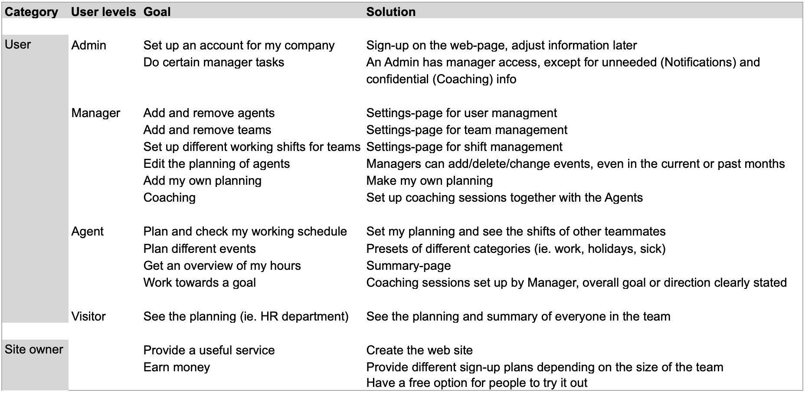

# EggBox

## Planning and coaching tool for great customer service teams.

### Get rid of your complicated spread sheets when you plan your team. One tool helps you to get organised and develop your staff - In one simple application.

Live-website: https://ci-ms4-team-tool.herokuapp.com/

# UX
## User stories:

## Strategy
Create a web service for a company to sign up and add employees (users). The page has a two fold strategy:
- Planning: A calendar type planning sheet for users to add and view their planning
- Coaching: Managers can plan their coaching sessions with Agents and set/check goals

## Scope

- A home page with Signup and Login functionality. A new Company to sign up initially gets the fee plan,
but can upgrade later in the settings to another (out of 4 plans)

- A backend database to support the functionality

- Sections for Planning, Coaching and Notifications

- Multiple settings and edit options according to the access permission level

- A total of 4 different access permission levels

- Set up of multiple teams

- Contact links

## Structure

### Please refer to the following PDF for a pagemap:

[Page Map](attachments/pagemap.pdf)

### This is the database schema (Sqlite3 in GitPod, Postgres in Heroku)

I decided to use a Shared table architecture (vs Multi tenant or multi database architecture) because that made it easier to change the database schema and migrations over the course of the project, and it uses less resources.

[Database Schema](attachments/database_schema.png)

- The Model 'Roles' is part of the schema even though it's currently not of any use to a user of the page. I left it in there
because there will be use in the futuer and there is already code in the project supporting it (mainly templates in the 'settings'-app),
and because records are already created upon signup (which will make implementation easier in the future for existing users).

### The difference between the 4 access levels:

| Task                                                    | Admin | Manager | Agent | Visitor |
|---------------------------------------------------------|-------|---------|-------|---------|
| Create company account                                  | x     |         |       |         |
| Create, delete and edit user accounts                   | x     | x       |       |         |
| Add/remove/edit elements in planning                    | x     | x       | x     |         |
| See agent's summary                                     | x     | x       | x     | x       |
| See all user's planning                                 | x     | x       | x     | x       |
| Create all user's coaching sessions                     |       | x       |       |         |
| See their own coaching goals                            |       |         | x     |         |
| Notification when other user's planning was modified    | x     | x       |       |         |

## Skeleton
[Wireframe](/attachments/wireframe.pdf)

## Surface
- Simple yet inviting home page displaying the 3 most important key functions of the Web App. Two Buttons on top, for Signup (call to action) and Login. Footer at the bottom with an ‚about‘ and a short ‚support‘-section
- Simple business-like color scheme (black white gray blue) inside the application
- Buttons slightly rounded and whenever possible the same size
- blue links signalise interaction (clickable)
- Show the main sections highlighted when selected (Planning/Coaching/Messages)
- Constant use of 2 fonts: Blinker for titles, Roboton (or Bootstrap standard) for text
- Fontawesome icons when appropriate
- Use of pictures that fit the described color scheme

# Features

### Current Features
- Company account creation
- Offering 4 different plans
- User account creation through an admin
- An Agent/Manager sees the planning of the corresponding team as a starting page after Login
- Creation of events in the planning
- Entry of coaching sessions by managers
- Messages (Messages section)
    - For Managers: when an Agent submits his planning or checks off a coaching goal
    - For Agents: When the Manager Approved or changed a planning, created/edited/deleted a coaching goal
- Messages (Bootstrap Toasts):
    - Warning messages: ie. when user has not the right level for a certain action, when entered an URL directly
    - Success messages (ie. submitted a planning or saved a new user)
- Security features:
    - Every action in the database checks if a user is logged in, and if he has the correct user level to perform this action
    - Use of the CSRF token for transmitting forms in Django
    - It's not possible to delete a team if there are still users attached to that team
    - It's not possible to delete active users

### Planned Features
- Users who stopped working and had no shift planned for the current month appear under a separate section "inactive" in 'user management',
and only inactive users can get deleted
- Localized weekstart (user can select if the weeks starts on Sunday, Monday, or any other day of the week)
- Options for Agents to change their shift without a manager, if either:
    - Two people with the same role are exchanging two shifts
    - There are already enough people in a shft
- Keyword search queries
- Optional email notifications in addition to the internal Messages
- Automatic alert email to Admins if the contract plan is about to run out and should be renewed.
- One manager can manage more than 1 team (important for coaching)

# Technologies used
- HTML
- CSS
- JavaScript
- Python
- Django
- Jinja
- Materialize
- (jQuery 3.4.1 (jQuery.com) to access DOM elements quicker, and react to user input)
- Google Fonts (fonts.google.com)
- Fontawesome for icons
- GitPod (gitpod.io) IDE
- GitHub (github.com) for sharing
- Git (for version control)
- MongoDB
- Heroku

# Testing

## Testing write-up

I ran the code through validation services
(https://validator.w3.org/, http://jigsaw.w3.org/css-validator/ and https://jshint.com/).
Please refer to the separate document [testing](/attachments/testing.md) for more details regarding
manual testing. Issues that need to be fixed in the future but don't affect the current main-functionality
are boxed and marked with a warning-sign ()

## Challenges

### django

### Structure

The j

# Deployment

## Create a local repository

## Deployment of project

## Credits

### Media
The photos used are from pixabay.com.

### Code
Besides the Code Institute Walkthrough projects, I often consulted the following sites:
- stackoverflow.com (for many general issues)
- w3schools.com (mainly to refresh python syntax)
- mongodb documentation, mainly: https://docs.mongodb.com/manual/tutorial/query-array-of-documents/ in order to work with arrays
- Youtube tutorial https://www.youtube.com/watch?v=Kcka5WBMktw (part 1) and https://www.youtube.com/watch?v=A291yJ92154 (part 2)
by "Pretty Printed": learning how to update the page without refreshing

Thanks also to my Code Institute mentor for the helpful input.
